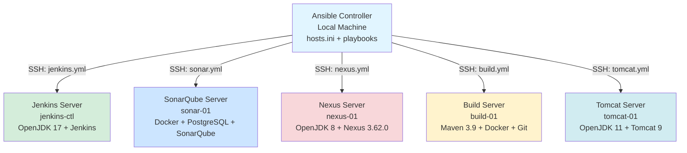
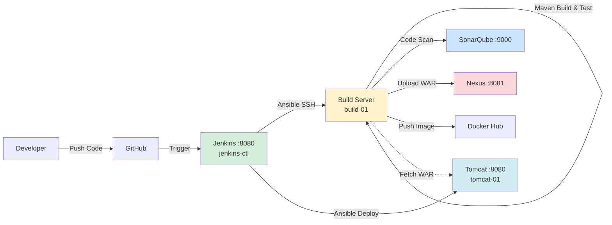
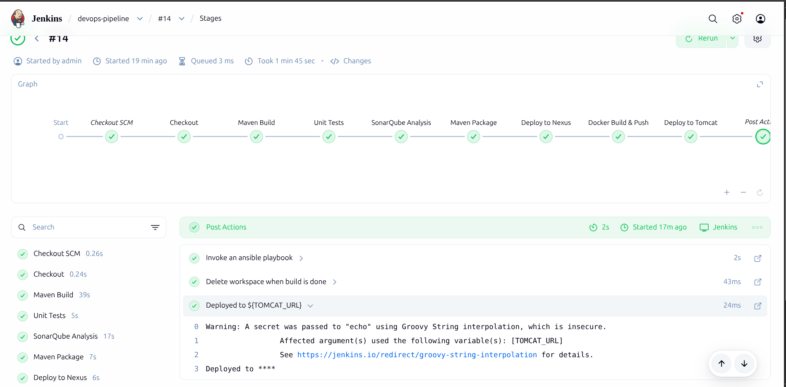
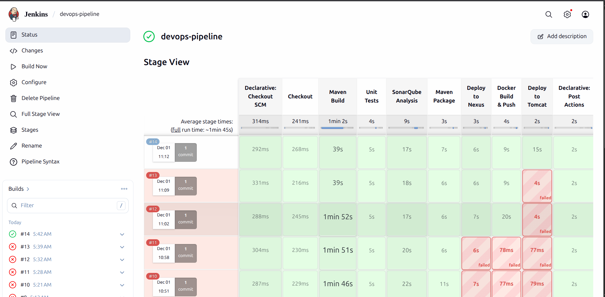
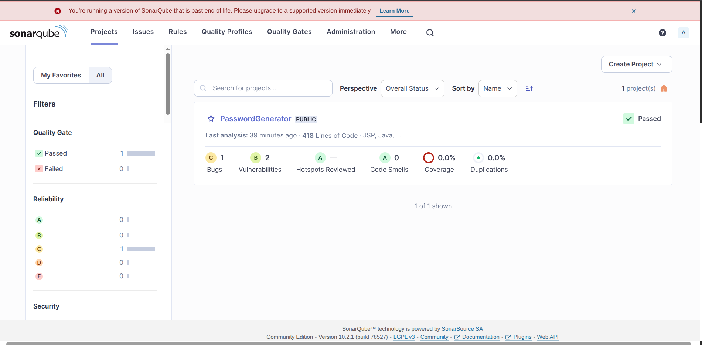
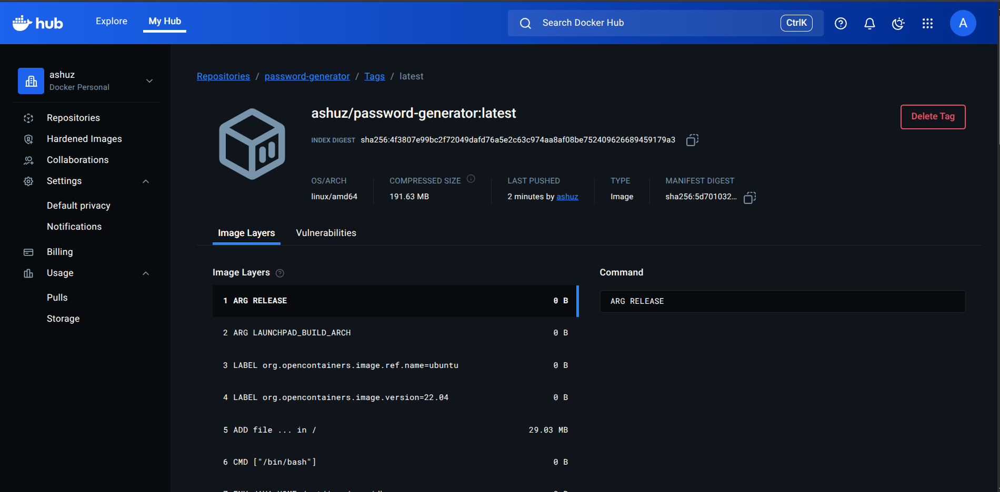
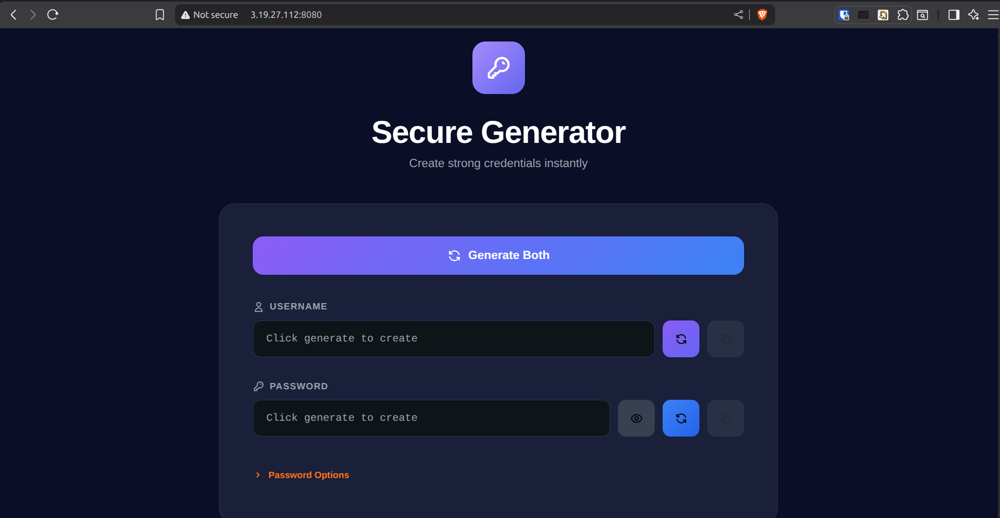

# CI/CD Pipeline Automation with Ansible

Automated deployment of a complete DevOps pipeline using Ansible playbooks. This project sets up Jenkins, SonarQube, Nexus, and Tomcat on separate servers with a dedicated build server.

## Architecture

| Service | Purpose | Port |
|---------|---------|------|
| **Jenkins** | CI/CD orchestration | 8080 |
| **SonarQube** | Code quality analysis | 9000 |
| **Nexus** | Artifact repository | 8081 |
| **Tomcat** | Application server | 8080 |
| **Build Server** | Maven + Docker builds |  |


## Server Setup Diagram




## Architecture Diagram




## Prerequisites

- 5 Ubuntu servers (EC2 instances or VMs)
- Ansible installed on your local machine
- SSH access to all servers (key-based authentication)
- Security groups allowing required ports

## Quick Start

### 1. Create Inventory File

Create `hosts.ini` with your server IPs:

```ini
[jenkins]
<JENKINS_IP> ansible_user=ubuntu ansible_ssh_private_key_file=~/.ssh/your-key.pem

[sonar]
<SONAR_IP> ansible_user=ubuntu ansible_ssh_private_key_file=~/.ssh/your-key.pem

[nexus]
<NEXUS_IP> ansible_user=ubuntu ansible_ssh_private_key_file=~/.ssh/your-key.pem

[build]
<BUILD_IP> ansible_user=ubuntu ansible_ssh_private_key_file=~/.ssh/your-key.pem

[tomcat]
<TOMCAT_IP> ansible_user=ubuntu ansible_ssh_private_key_file=~/.ssh/your-key.pem
```

### 2. Test Connectivity

```bash
ansible all -i hosts.ini -m ping
```

### 3. Deploy Services

Run playbooks in order:

```bash
# Deploy Jenkins
ansible-playbook -i hosts.ini playbooks/jenkins.yml

# Deploy SonarQube
ansible-playbook -i hosts.ini playbooks/sonar.yml

# Deploy Nexus
ansible-playbook -i hosts.ini playbooks/nexus.yml

# Configure Build Server
ansible-playbook -i hosts.ini playbooks/build.yml

# Deploy Tomcat
ansible-playbook -i hosts.ini playbooks/tomcat.yml
```

## Initial Access

### Jenkins (`http://<JENKINS_IP>:8080`)
```bash
# Get initial admin password
ansible jenkins -i hosts.ini -a "cat /var/lib/jenkins/secrets/initialAdminPassword"
```

### SonarQube (`http://<SONAR_IP>:9000`)
- Default: `admin` / `admin` (change on first login)

### Nexus (`http://<NEXUS_IP>:8081`)
```bash
# Get initial admin password
ansible nexus -i hosts.ini -a "cat /opt/nexus-data/admin.password"
```

### Tomcat (`http://<TOMCAT_IP>:8080`)
- Manager: `admin` / `admin123`
- Deployer: `deployer` / `deployer123`

## What Each Playbook Does

| Playbook | Installs |
|----------|----------|
| `jenkins.yml` | OpenJDK 17, Jenkins LTS |
| `sonar.yml` | Docker, PostgreSQL, SonarQube 10.2 |
| `nexus.yml` | OpenJDK 8, Nexus Repository 3.62.0 |
| `build.yml` | Maven 3.9, Docker, Git |
| `tomcat.yml` | OpenJDK 11, Tomcat 9 |

## Post-Deployment Configuration

### 1. Install Jenkins Plugins

1. Log in to Jenkins at `http://<JENKINS_IP>:8080`
2. Navigate to **Manage Jenkins** → **Plugins** → **Available Plugins**
3. Install these plugins (select "Install without restart"):
   - `Ansible`
   - `Pipeline`
   - `Docker Pipeline` (or `docker-workflow`)

### 2. Add Jenkins Credentials

Go to **Manage Jenkins** → **Credentials** → **System** → **Global credentials** → **Add Credentials**

| Type | ID | Username | Password/Secret | Description |
|------|----|-----------|--------------------|-------------|
| SSH Username with private key | `ssh-key` | `ubuntu` | Paste `devops-key.pem` content | SSH Key for Agents |
| Secret text | `sonar-token` | - | Your SonarQube Token | SonarQube Token |
| Username with password | `nexus-cred` | `admin` | `admin123` (or new password) | Nexus Admin Credentials |
| Secret text | `docker-hub-token` | - | Your Docker Hub Access Token | Docker Hub Token |
| Username with password | `docker-hub-creds` | Your Docker Hub Username | Your Docker Hub Password/Token | Docker Hub Credentials |
| Secret text | `sonar-url` | - | `http://<SONAR_IP>:9000` | SonarQube URL |
| Secret text | `nexus-url` | - | `http://<NEXUS_IP>:8081` | Nexus URL |
| Secret text | `tomcat-url` | - | `http://<TOMCAT_IP>:8080` | Tomcat URL |
| Secret file | `hosts-ini` | - | Upload your `hosts.ini` file | Ansible Inventory File |

**Important:** When creating the `hosts.ini` file for Jenkins, use this format (without SSH key paths):

```ini
[jenkins]
<JENKINS_IP> ansible_user=ubuntu

[sonar]
<SONAR_IP> ansible_user=ubuntu

[nexus]
<NEXUS_IP> ansible_user=ubuntu

[build]
<BUILD_IP> ansible_user=ubuntu

[tomcat]
<TOMCAT_IP> ansible_user=ubuntu
```

The SSH authentication is handled by Jenkins using the `ssh-key` credential in the pipeline.

### 3. Create Pipeline Job

1. Click **New Item** → Enter name `devops-pipeline` → Select **Pipeline** → **OK**
2. Scroll to **Pipeline** section
3. Set **Definition**: `Pipeline script from SCM`
4. Set **SCM**: `Git`
5. Enter **Repository URL**: Your Git repository URL
6. Set **Branch Specifier**: `*/main`
7. Set **Script Path**: `Jenkinsfile`
8. Click **Save**

### 4. Run Your First Build

Click **Build Now** and monitor the pipeline progress!

## Troubleshooting

**Connection refused errors:**
- Check security groups allow required ports
- Verify SSH key permissions: `chmod 400 ~/.ssh/your-key.pem`

**Service not starting:**
```bash
# Check service status
ansible <group> -i hosts.ini -a "systemctl status <service>"

# View logs
ansible <group> -i hosts.ini -a "journalctl -u <service> -n 50"
```

**Docker permission denied:**
```bash
# Verify user in docker group
ansible build -i hosts.ini -a "groups ubuntu"
```

## Project Structure

```
.
├── playbooks/
│   ├── jenkins.yml      # Jenkins controller setup
│   ├── sonar.yml        # SonarQube with PostgreSQL
│   ├── nexus.yml        # Nexus repository manager
│   ├── build.yml        # Build server configuration
│   ├── tomcat.yml       # Tomcat application server
│   ├── ci.yml           # CI pipeline tasks
│   └── deploy.yml       # Deployment tasks
├── src/                 # Sample Java application
├── Dockerfile           # Application container
├── Jenkinsfile          # Pipeline definition
├── pom.xml              # Maven configuration
└── README.md            # This file
```








